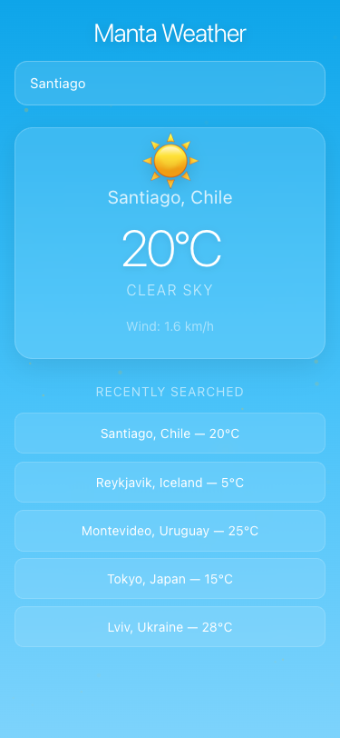
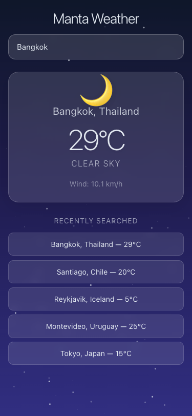
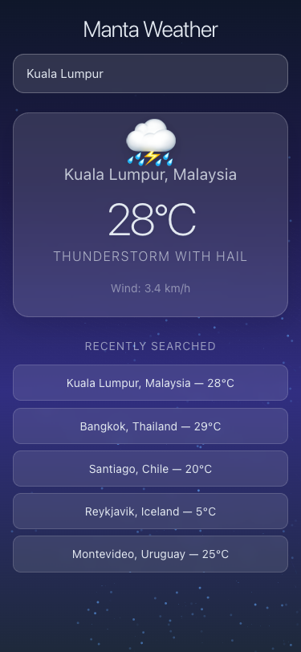
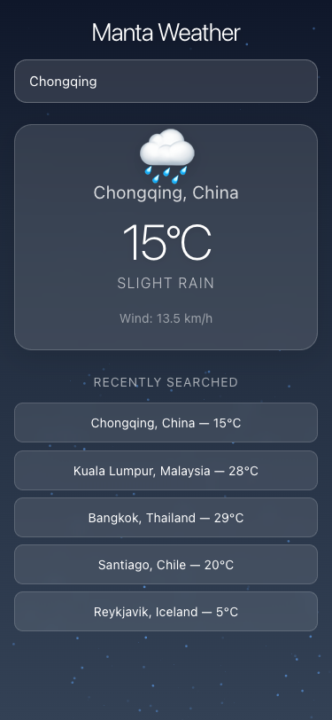
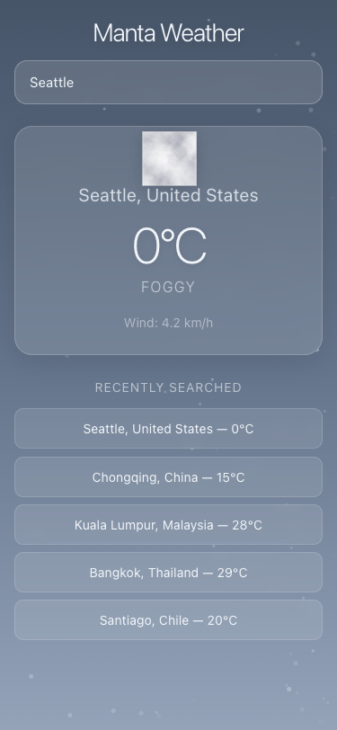

# Manta Weather

A weather app with animated, weather-responsive backgrounds built with React, TypeScript, and Cloudflare Workers.

<p align="center">
  
  
  
  
  
</p>

## Features

- Auto-detects user location via browser geolocation
- City search with autocomplete (Open-Meteo geocoding API)
- Animated backgrounds that change based on weather conditions (clear, rain, snow, thunderstorm, fog)
- Smooth transitions when switching between cities
- Recently searched cities with persistent storage (Cloudflare Durable Objects)
- Responsive design (mobile, tablet, desktop)

## Tech Stack

- **Frontend**: React 19, TypeScript, Vite, Tailwind CSS v4
- **Backend**: Cloudflare Workers + Durable Objects
- **Animations**: shadcn/ui, Magic UI, Aceternity UI, Motion (Framer Motion)
- **APIs**: Open-Meteo (weather + geocoding), Nominatim (reverse geocoding)

## Development

```bash
pnpm install
pnpm run dev          # Vite dev server
pnpm run dev:worker   # Cloudflare Worker (local)
```

## Deployment

```bash
pnpm run build
npx wrangler deploy
```
